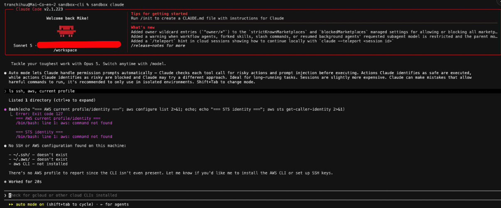

# Sandbox cli

Run AI coding agents in a container that can see your project and nothing else.

Instead of letting Claude Code, Codex, or Gemini CLI loose on your machine, `sandbox`
launches them inside a container where the only thing mounted is the current
directory. Your SSH keys, cloud credentials, browser data, and the rest of your home
directory are not there to be read — not blocked by a prompt or a policy the agent
could talk its way past, simply absent from the filesystem.

The agent doesn't need to know or cooperate. It just sees a normal Linux box.



## Install

Docker is the only hard requirement (Docker Desktop, OrbStack, and Rancher Desktop
all work) — the binary can be built inside a container:

```bash
make install-docker    # builds in golang:1.23-alpine → /usr/local/bin/sandbox
```

`PREFIX=~/.local make install-docker` puts it somewhere that doesn't need sudo. The
Go module cache lives in `~/.cache/sandbox-cli-go`, so rebuilds are fast.

With a Go 1.23+ toolchain on the host, the native path is quicker:

```bash
make install    # or: make build  →  ./bin/sandbox
```

## Use

```bash
cd ~/code/my-project
sandbox claude          # or: codex, gemini, bash, or anything in the image
```

Arguments after the agent name go straight to the agent:

```bash
sandbox claude --resume
sandbox codex --full-auto
```

Other commands:

```bash
sandbox version
sandbox --help
sandbox dockerfile        # print the image's Dockerfile, to copy and edit
sandbox --debug claude    # print docker command, mounts, container name
```

The first run builds the image, which takes a few minutes. After that, startup is
roughly the cost of `docker run`.

If Docker isn't running, `sandbox` starts it — on macOS it opens whichever engine
your active `docker context` points at. On Linux the daemon needs root, so it prints
the `systemctl` command instead of sudo-ing behind your back.

## What the agent can reach

| | |
|---|---|
| `/workspace` | your current directory, read-write |
| `$HOME` (`/home/node`) | empty, isolated, persisted in a Docker volume |
| everything else | the container's own filesystem |

Your host home directory is never mounted. `sandbox` refuses to run from `$HOME` or
`/` outright, since mounting either would defeat the point.

The isolated HOME lives in a named volume (`sandbox-cli-home`), so agent logins and
caches survive between sessions without the agent ever touching your real home. To
reset it:

```bash
docker volume rm sandbox-cli-home
```

Containers are removed on exit and named `sandbox-<project>-<pid>` while running.

### What this does *not* protect against

Network access is unrestricted — an agent can still reach the internet and anything
your machine can route to. So is whatever you put in `/workspace`: a `.env` file in
your project is fully readable. This isolates your *identity*, not your project's
own secrets.

## Inside the container

Alpine with bash, git, curl, less, ripgrep, Node.js 26, npm, pnpm, Python 3, a C
toolchain for native `npm`/`pip` builds, and the Claude Code, Codex, and Gemini CLIs.

**No per-project language runtimes.** Node is here because the agent CLIs are Node
packages; Python and the C toolchain because `npm install` and `pip install` compile
native modules when an agent runs a project's tests. Beyond that, one baked version is
the wrong version for half the projects it meets, and the agent runs as a non-root user
so it cannot install another. Add what you need instead:

```bash
sandbox dockerfile > ~/.sandbox/Dockerfile   # start from the default
# edit it — e.g. add `go` to the apk line
echo '{"image":"sandbox-go:latest"}' > ~/.sandbox/config.json
sandbox claude                               # builds and uses your image
```

`~/.sandbox/Dockerfile` replaces the built-in one entirely. Give it its own image name in
`config.json` so it doesn't collide with the default.

## Configuration

Optional, at `~/.sandbox/config.json`. Absent file means defaults; absent fields keep
their default; a malformed file warns and falls back rather than killing the session.

```json
{
  "image": "sandbox-cli:latest",
  "log_level": "info"
}
```

`log_level` is one of `debug`, `info`, `warn`, `error`. `--debug` overrides it.

## Agent skill

`skills/sandbox-cli/SKILL.md` teaches an agent to install and drive `sandbox` itself — so
Claude Code can put its own commands in the container instead of running them on your
machine. Install it once:

```bash
ln -s "$PWD/skills/sandbox-cli" ~/.claude/skills/sandbox-cli   # Claude Code
```

Other runtimes read `~/.agents/skills/`. A copy works as well as a symlink; the symlink
just keeps it current when you `git pull`.

## Layout

```
cmd/sandbox/        entry point
internal/cli/       command surface (cobra)
internal/config/    ~/.sandbox loading
internal/docker/    container lifecycle + embedded Dockerfile
internal/logger/    structured logging (slog)
```

`internal/docker` shells out to the `docker` binary rather than using the Docker SDK:
`docker run -it` already gives us interactive terminals, TTY handling, and cleanup,
which is most of what the SDK would be for.

```bash
make test
make test-docker    # same tests, no host Go needed
make image          # rebuild the sandbox image
```

## Not implemented

Network isolation, credential/SSH/git proxying, approval prompts, audit logs, policy
engine, and Firecracker or Kubernetes backends. There is one backend and no interface
in front of it; the interface can appear when the second backend does.

## Contributing

See [CONTRIBUTING.md](CONTRIBUTING.md). Security issues go through a
[private advisory](https://github.com/TranChiHuu/sandbox-cli/security/advisories/new),
not a public issue — see [SECURITY.md](SECURITY.md) for what counts as in scope.

## License

MIT — see [LICENSE](LICENSE).
